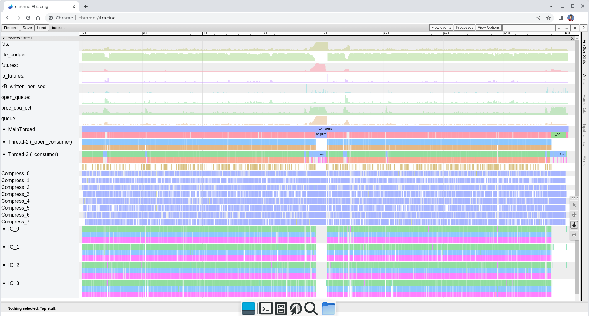

# fastzip

This project lets you efficiently create and combine zip files.


## What is "fast" in "faszip"?

Mainly two things:

1. Multithreaded compression (DEFLATE), similar to `pigz`
2. The ability to copy/merge zips without recompressing, similar to `zipmerge`

It's also pure python, able to stream the input (without needing the central
directory to be present), and features a rules-based compression method chooser,
to avoid _increasing_ the size of tiny files.


## Demo

Similar API to ZipFile

```py
from pathlib import Path
from fastzip.write import WZip
with WZip(Path("out.zip")) as z:
    z.write(Path("a"))
```

Merging existing files

```py
from fastzip.read import RZipStream
from fastzip.write import WZip
with WZip(Path("out.zip")) as z:
    for entry in RZipStream("zip1.zip").entries():
        z.enqueue_precompressed(*entry)
    for entry in RZipStream("zip2.zip").entries():
        z.enqueue_precompressed(*entry)
```

If you'd like to customize the number of threads, choice of compression,
filename within the archive, etc those are all possible.  Right now look at the
source, but the basic gist is:

```py
from io import BytesIO
from pathlib import Path
from fastzip.write import WZip
from fastzip.chooser import CompressionChooser

force_store = CompressionChooser(default="store")
with WZip(Path("out.zip"), threads=2, chooser=force_store) as z:
    z.write(Path("a"), archive_path=Path("inzipname"), synthetic_mtime=0, fobj=BytesIO(b"foo"))
```

## Benchmark

Tested on 8- and 12-core xeons, it's able to use about 7.5 and 11 cores,
repsectively for sufficiently large workloads.  See the next section about bottlenecks.

```sh
$ dd if=/dev/urandom of=a bs=1M count=512
512+0 records in
512+0 records out
536870912 bytes (537 MB, 512 MiB) copied, 2.17395 s, 247 MB/s

$ ./demo.sh
+ rm -f a.zip a1.zip a2.zip
+ cat a
+ /usr/bin/time zip -o a.zip a
  adding: a (deflated 0%)
11.35user 0.24system 0:11.60elapsed 99%CPU (0avgtext+0avgdata 2892maxresident)k
24inputs+1048752outputs (1major+205minor)pagefaults 0swaps
+ /usr/bin/time python -m zipfile -c a1.zip a
12.61user 0.44system 0:14.53elapsed 89%CPU (0avgtext+0avgdata 11360maxresident)k
0inputs+1048920outputs (0major+1623minor)pagefaults 0swaps
+ /usr/bin/time python -m fastzip -c -o a2.zip a
20.39user 0.56system 0:02.78elapsed 753%CPU (0avgtext+0avgdata 1079140maxresident)k
0inputs+1048968outputs (0major+149864minor)pagefaults 0swaps
+ ls -l a.zip a1.zip a2.zip
-rw-r--r-- 1 tim tim 537034782 Nov 16 13:47 a1.zip
-rw-r--r-- 1 tim tim 537037407 Nov 16 13:47 a2.zip
-rw-r--r-- 1 tim tim 536957493 Nov 16 13:01 a.zip
```

## Performance Bottlenecks

There are potentially many.  Some that I've observed include:

1. Slow overwrite performance (on ext4); this is why WZip only opens in 'xb' mode.
2. Small files
   a. Slow stat (~0.5mS even on a ramdisk)
   b. zlib.crc32 doesn't release the gil < 5KiB
   c. small files use up the file budget without making much forward progress
      (reordering to have one large file every (file\_budget-1) may reduce
      stalls
3. Small output buffer (WZip opens with 1MB now)
4. Seeks (which require flushing output buffer)
5. ThreadPoolExecutor giant lock (submitting a future requires grabbing two
   locks but one of them is a global lock to detect interpreter shutdown?)
5. Deflate chunk size (smaller chunks means better parallelism on medium sized
   files and less blocking on IO, but also scheduling many more futures, crc32
   calls, and crc32\_combine).  Larger chunk size also means a slightly better
   compression ratio.
6. Garbage collection (some recent changes to increase parallelism seem to
   increase the quantity of GC)
7. Mixing deflate and zstd -- although the number of threads is generally
   shared between them, there are going to be stalls and overruns when
   switching.

When in doubt, generate a trace, and look for bottlenecks (either blank time,
which is not doing useful work, or basically anything besides a compress itself
that seems to take a long time.

## Sample Traces

This one only really performs well for the section in the middle marked
"acquire" -- that is where it's run out of some resource to be able to queue
more data, but also the compression threads are fully working.  The gold
seemingly-unlabeled events are GC, and you can see the cpu graph is generally
quite low.



This is that middle section zoomed in, and you can see more clearly that the
compression threads are busy and the IO threads have some idle time.  The gaps
in MainThread imply that there is some hidden work.


## Future plans (from drawbacks)

Near-term problems:

1. Errors that happen in threads aren't always reported in the obvious way.
2. Adding directories (rather than files) is serial.
3. Files must be MMAP-able, and on a 32-bit system this will probably run out
   of process address space.
4. There is an open-file budget, but there is no formal memory budget; the
   output futures are likely to buffer about 2x the size of the largest file,
   in memory.  For example, the 512MB file above has a peak memory of about
   1GB.
5. `WZip` is too complicated and has many complicated methods.  This makes it
   hard to refactor, and hard to extend.
6. Not enough validation (e.g. duplicate filenames, filenames with ".." in
   them), and not totally sure the archive name code is solid.

NOTE: The API is expected to change several times before version 1.0; if adding
a dep edge to this project (e.g. if you use a hypothetical version `0.4` make
sure you specify `>=0.4, <0.5`.


# License

fastzip is copyright [Tim Hatch](https://timhatch.com/), and licensed under
the MIT license.  I am providing code in this repository to you under an open
source license.  This is my personal repository; the license you receive to
my code is from me and not from my employer. See the `LICENSE` file for details.
